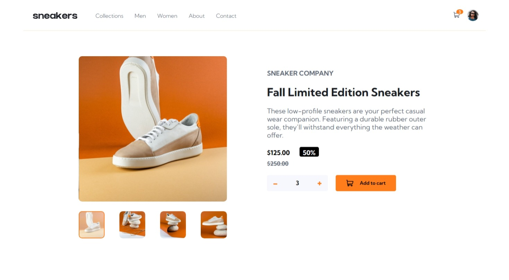

This is my solution to the E-commerce Product Page Challenge on Frontend Mentor.
The challenge helped me improve my responsive layout skills, handle interactive image galleries, and manage JavaScript event listeners efficiently.

Overview
The challenge
Users should be able to:

View the optimal layout for the site depending on their device's screen size

See hover states for all interactive elements

Open a lightbox gallery by clicking on the large product image (desktop only)

Switch the large product image by clicking on thumbnail images

Add items to the cart

View and remove items from the cart

Screenshot

This is my solution to the E-commerce Product Page Challenge on Frontend Mentor.
The challenge helped me improve my responsive layout skills, handle interactive image galleries, and manage JavaScript event listeners efficiently.

Continued development
In future projects, I want to:

Add keyboard navigation to the lightbox gallery.

Implement image zoom on desktop view.

Enhance cart UI with animations.
